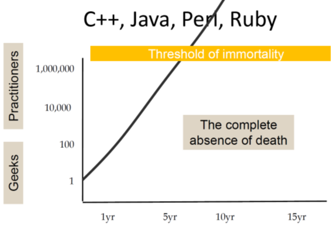

# Why Haskell Matters

This is a work in progress article.

> Haskell doesn't solve different problems than other languages.
> But it solves them differently.
> 
> -- unknown author

## A strange development over time

In a much quoted talk about [the Haskell journey](https://www.youtube.com/watch?v=re96UgMk6GQ) 
from the beginnings in the eighties of the last century until 2017 Simon Peyton Jones speaks about the
rather untypical life story of haskell.

First he shows a chart for the typical life cycle of research languages. They are often created by 
a single researcher (who also is the single user) and most of them will be abandoned after a few years:

A more successful research language gains some interest in a larger community but will still not 
escape the "geek" community and typically will die a bit slower:

 

Most popular programming languages are adopted by 
large number of users and thus will quickly reach "the threshold of immortality".
That is the base of existing code will grow so large that the language will be used for decades:

 

In the next chart he rather jokingly depicts the sad fate of languages designed by committees.
They simply never take of:

 

Finally he presents a chart for Haskell:

The development shown in this chart is rather untypical: 
As Haskell started as a research language and was 
designed by a committee it should have been abandoned long before the millennium.

But instead it gained some momentum in the early years followed by a rather quiet phase during 
the decade of OO hype (Java was released in 1995).
And then we see a continous growth of interest since about 2005.

## Actual usage versus discussion topic

## So why is Haskell such a hot topic in the software development community?

- Funktionen sind 1st class citizens (higher order functions, Funktionen könen neue Funktionen erzeugen und andere Funktionen als Argumente haben)

- Abstraktion über Resource management und Abarbeitung (=> deklarativ)

- Immutability ("Variables do not Vary")

- Seiteneffekte müssen in Funktions signaturen explizit gemacht werden.
D.H wenn keine Seiteneffekt angegeben ist, verhindert der Compiler, dass welche auftreten !
Damit lässt sich Seiteneffektfreie Programmierung realisieren ("Purity")

- Evaluierung in Haskell ist "non-strict" (aka "lazy"). Damit lassen sich z.B. abzählbar unendliche Mengen (z.B. alle Primzahlen) sehr elegant beschreiben.
  Aber auch kontrollstrukturen lassen sich so selbst bauen (super für DSLs) 

- Static and Strong typing (Es gibt kein Casting)

- Type Inferenz. Der Compiler kann die Typ-Signaturen von Funktionen selbst ermitteln. (Eine explizite Signatur ist aber möglich und oft auch sehr hilfreich für Doku und um Klarheit über Code zu gewinnen.)

- Polymorphie (Z.B für "operator overloading", Generische Container Datentypen, etc. auf Basis von "TypKlassen")

- Algebraische Datentypen (Summentypen + Produkttypen) AD helfen typische Fehler, di man von OO Polymorphie kenn zu vermeiden. Sie erlauben es, Code für  viele Oerationen auf Datentypen komplett automatisch vom Compiler generieren zu lassen).

- Pattern Matching erlaubt eine sehr klare Verarbeitung von ADTs

- Eleganz: Viele Algorithmen lassen sich sehr kompakt und nah an der Problemdomäne formulieren.

- Data Encapsulation durch Module

- Weniger Bugs durch

    - Purity, keine Seiteneffekte

    - Starke typisierung. Keine NPEs !

    - Hohe Abstraktion, Programme lassen sich oft wie eine deklarative Spezifikation des Algorithmus lesen

    - sehr gute Testbarkeit durch "Composobility"
    
        - das "ports & adapters" Beispiel: https://github.com/thma/RestaurantReservation
        
        - TDD / DDD
    
    - Memory Management (sehr schneller GC)

    - Modulare Programme. Es gibt ein sehr einfaches aber effektive Modul System und eine grosse Vielzahl kuratierter Bibliotheken.

    ("Ich habe in 5 Jahre Haskell noch nicht ein einziges Mal debuggen müssen")

- Performance: keine VM, sondern sehr optimierter Maschinencode. Mit ein wenig Feinschliff lassen sich oft Geschwindigkeiten wie bei handoptimiertem C-Code erreichen. 

## toc for code chapters (still in german)

- Werte
- Funktionen
- Listen
- Lazyness
    - List comprehension
    - Eigene Kontrollstrukturen
    
- Algebraische Datentypen
    - Summentypen : Ampelstatus
    - Produkttypen (int, int)
      Beispiel: Baum mit Knoten (int, Ampelstatus) dann mit map ein Ampelstatus
- deriving (Show, Read) für einfache Serialisierung
- Homoiconicity (Kind of)
- Maybe Datentyp
    - totale Funktionen
    - Verkettung von Maybe operationen  
      (um die "dreadful Staircase" zu vermeiden)
      => Monoidal Operations
      
 - explizite Seiten Effekte -> IO Monade
 
 - TypKlassen
   - Polymorphismus
     z.B. Num a, Eq a
   - Show, Read => Homoiconicity bei Serialisierung
   - Automatic deriving
     (Functor mit Baum Beispiel)
     
- Testbarkeit
    - TDD, higher order functions assembly, Typklassen dispatch (https://jproyo.github.io/posts/2019-03-17-tagless-final-haskell.html)